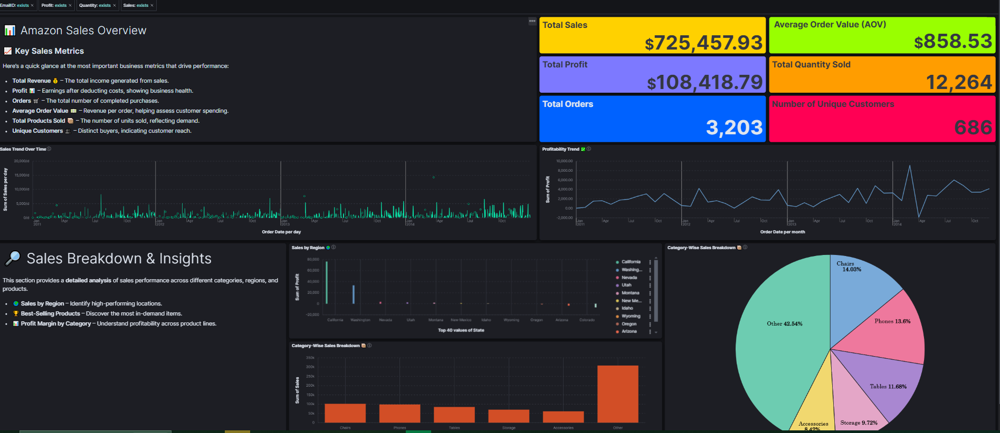

# Kibana Dashboard Documentation


[View Live Dashboard](http://localhost:5601/app/r/s/CHOaj)



## Dataset

We used an **Amazon Sales Dataset** from Kaggle:
[Kaggle Data Link](https://www.kaggle.com/datasets/anandshaw2001/amazon-sales-dataset)

### Dataset Columns:

- **Order Date** - Date when the order was placed.
- **Ship Date** - Date when the order was shipped.
- **Email ID** - Unique customer identifier.
- **Geography** - Location of orders by users.
- **Category** - Product category.
- **Product Name** - Name of the product.
- **Sales** - Revenue generated from sales.
- **Quantity** - Number of units sold.
- **Profit** - Profit earned from sales.

---

## Steps Followed

### 1. Data Ingestion

- Uploaded the dataset into **Elasticsearch**.
- Created an **Index Pattern** named `amazon_sales_new`.
- Some fields were identified as **keywords**, so type casting was performed to enable aggregations.
- Used a **regex-based Painless script** to extract and convert the state information from the `Geography` field.

### 2. Visualization & Dashboard Creation

#### **Top Section: Summary Metrics**

- **Total Revenue 💰** – Key financial metric.
- **Profit 📊** – Indicates business profitability.
- **Orders 🛒** – Total number of orders placed.
- **Average Order Value 💵** – Helps analyze spending patterns.
- **Total Products Sold 📦** – Number of items sold.
- **Unique Customers 👥** – Customer base size.

#### **Middle Section: Graphs & Trends**

- **Sales Trend Over Time** – Line graph showing revenue fluctuations.
- **Sales by Category** – Pie chart to visualize product category contributions.
- **Profit vs. Sales Scatter Plot** – Correlation analysis.

#### **Bottom Section: Detailed Breakdown**

- **Sales by Region** – Bar chart showing top-selling locations.
- **Best-Selling Products** – Table visualization ranking top products.
- **Customer Purchase Patterns** – Heatmap for time-based analysis.

### 3. Customization & Styling

- **Dark Mode Enabled** (Kibana > Advanced Settings > Dark Mode).
- **Grid Layout** for clear sectioning.
- **Markdown Titles** for better readability.
- **Color-coded Visualizations** for easy interpretation.

---

## Docker Setup

### Prerequisites:
- Install **Docker** and **Docker Compose**.

### Steps to Set Up Elastic Stack with Kibana:
1. Create a `docker-compose.yml` file:

```yaml
version: '3.7'
services:
  elasticsearch:
    image: docker.elastic.co/elasticsearch/elasticsearch:8.5.0
    container_name: elasticsearch
    environment:
      - discovery.type=single-node
      - "ES_JAVA_OPTS=-Xms512m -Xmx512m"
    ports:
      - "9200:9200"
    networks:
      - elastic_network
  
  kibana:
    image: docker.elastic.co/kibana/kibana:8.5.0
    container_name: kibana
    ports:
      - "5601:5601"
    depends_on:
      - elasticsearch
    networks:
      - elastic_network

networks:
  elastic_network:
    driver: bridge
```

2. Run the containers:
```bash
docker-compose up -d
```

3. Access Kibana at `http://localhost:5601`.

4. Verify Elasticsearch is running:
```bash
curl -X GET "localhost:9200/_cat/health?v"
```

---

## Next Steps

- Further refinement of visualizations.
- Advanced filtering and drill-downs.
- Enhancing interactivity with more scripted fields.

---

## Conclusion

The Kibana dashboard provides a **data-driven** overview of Amazon sales, helping in trend analysis, performance evaluation, and business decision-making. 🚀

