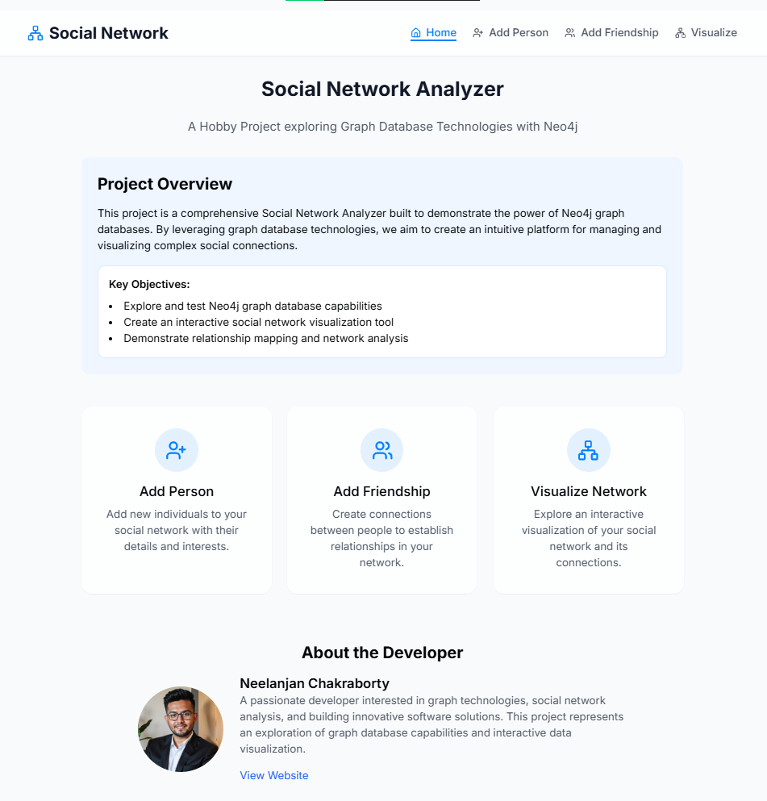
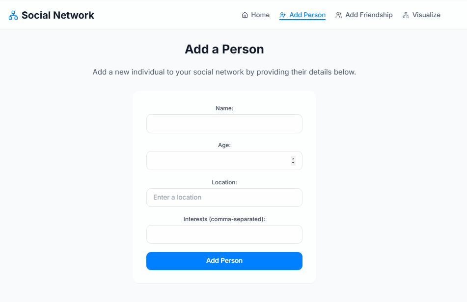
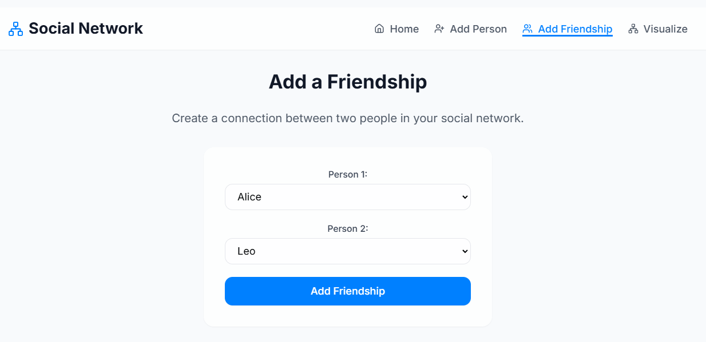
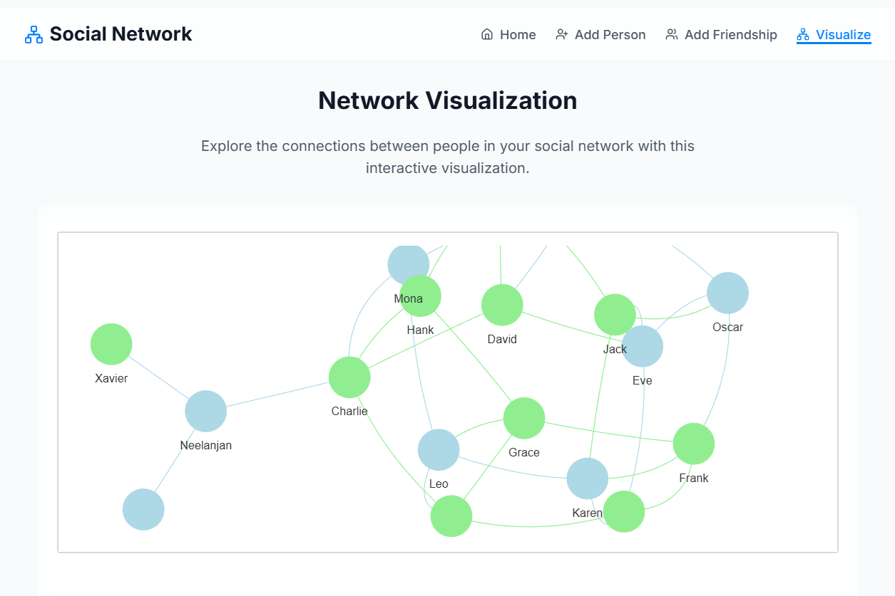

# Social Network Analyzer with Neo4j, Flask, and React

Welcome to the **Social Network Analyzer** project! This full-stack application allows you to create and analyze a social network using **Neo4j** as the graph database, **Flask** as the backend, and **React** as the frontend. The application enables you to add people, create friendships, and visualize the social network based on shared interests. The entire application is deployed using **Neo4j Aura** and **Render** for seamless cloud hosting.

---





## **Features**
- **Social Network Management**:
  - Add people with attributes like name, age, location, and interests.
  - Create friendships between people.
  - Find mutual friends.
  - Recommend friends based on shared interests.
- **Visualization**:
  - Visualize the social network as an interactive graph.
  - Display people's names, locations, and interests on the graph.
- **Full-Stack Application**:
  - **Backend**: Flask API to interact with the Neo4j database.
  - **Frontend**: React app for a modern, interactive user interface.
- **Deployment**:
  - Neo4j Aura for cloud-based graph database hosting.
  - Render for deploying the Flask backend and React frontend.

---

## **Table of Contents**
1. [Installation Guide](#installation-guide)
2. [Setting Up Neo4j](#setting-up-neo4j)
3. [Testing Queries](#testing-queries)
4. [Creating the Social Analyzer](#creating-the-social-analyzer)
5. [Building the Flask Backend](#building-the-flask-backend)
6. [Designing the React Frontend](#designing-the-react-frontend)
7. [Deploying the Application](#deploying-the-application)
8. [Folder Structure](#folder-structure)
9. [Contributing](#contributing)
10. [License](#license)

---

## **Installation Guide**

### **Prerequisites**
- Python 3.8+
- Node.js 16+
- Neo4j Aura account (free tier)
- Render account (free tier)
- Vercel account (free tier)

---

## **Setting Up Neo4j**

### **Step 1: Create a Neo4j Aura Database**
1. Sign up for a free account at [Neo4j Aura](https://neo4j.com/cloud/aura/).
2. Create a new **Free Instance**.
3. Note down the **Connection URI**, **Username**, and **Password**.

### **Step 2: Test the Connection**
1. Use the Neo4j Browser provided by Aura to test the connection.
2. Run a sample query to ensure the database is working:
   ```cypher
   MATCH (n) RETURN n LIMIT 25;
   ```

---

## **Testing Queries**

### **Step 1: Explore the Movies Dataset**
Neo4j Aura comes with a built-in **Movies Dataset**. Use the following queries to explore it:

1. **Find all movies**:
   ```cypher
   MATCH (m:Movie) RETURN m;
   ```

2. **Find actors in a movie**:
   ```cypher
   MATCH (m:Movie {title: "The Matrix"})<-[:ACTED_IN]-(a:Person) RETURN a;
   ```

3. **Find movies by an actor**:
   ```cypher
   MATCH (a:Person {name: "Keanu Reeves"})-[:ACTED_IN]->(m:Movie) RETURN m;
   ```

---

## **Creating the Social Analyzer**

### **Step 1: Add People**
Use the following query to add a person to the social network:
```cypher
CREATE (p:Person {name: "Alice", age: 30, location: "New York", interests: ["music", "travel"]});
```

### **Step 2: Add Friendships**
Create a friendship between two people:
```cypher
MATCH (a:Person {name: "Alice"}), (b:Person {name: "Bob"})
CREATE (a)-[:FRIENDS_WITH]->(b);
```

### **Step 3: Find Mutual Friends**
Find mutual friends between two people:
```cypher
MATCH (a:Person {name: "Alice"})-[:FRIENDS_WITH]->(mutual)<-[:FRIENDS_WITH]-(b:Person {name: "Charlie"})
RETURN mutual;
```

---

## **Building the Flask Backend**

### **Step 1: Install Dependencies**
1. Clone the repository:
   ```bash
   git clone https://github.com/your-username/social-network-analyzer.git
   cd social-network-analyzer/backend
   ```
2. Install Python dependencies:
   ```bash
   pip install -r requirements.txt
   ```

### **Step 2: Configure Environment Variables**
Create a `.env` file in the `backend` folder:
```
NEO4J_URI=neo4j+s://453c0395.databases.neo4j.io
NEO4J_USER=neo4j
NEO4J_PASSWORD=your-password
```

### **Step 3: Run the Flask App**
Start the Flask backend:
```bash
python run.py
```

---

## **Designing the React Frontend**

### **Step 1: Install Dependencies**
1. Navigate to the `frontend` folder:
   ```bash
   cd ../frontend
   ```
2. Install Node.js dependencies:
   ```bash
   npm install
   ```

### **Step 2: Configure Environment Variables**
Create a `.env` file in the `frontend` folder:
```
REACT_APP_API_URL=https://your-backend.onrender.com
```

### **Step 3: Run the React App**
Start the React frontend:
```bash
npm start
```

---

## **Deploying the Application**

### **Step 1: Deploy Flask Backend on Render**
1. Push your code to GitHub.
2. Create a new **Web Service** on Render.
3. Connect your GitHub repository and configure the service.
4. Add environment variables:
   - `NEO4J_URI`
   - `NEO4J_USER`
   - `NEO4J_PASSWORD`

### **Step 2: Deploy React Frontend on Vercel**
1. Push your code to GitHub.
2. Create a new **Project** on Vercel.
3. Connect your GitHub repository and configure the project.
4. Add environment variables:
   - `REACT_APP_API_URL`

---

## **Folder Structure**
```
social-network-analyzer/
├── backend/
│   ├── app/
│   │   ├── __init__.py
│   │   ├── routes.py
│   │   └── templates/
│   ├── social_network/
│   │   ├── __init__.py
│   │   ├── social_network.py
│   │   └── utils.py
│   ├── requirements.txt
│   ├── run.py
│   └── .env
├── frontend/
│   ├── public/
│   ├── src/
│   │   ├── components/
│   │   ├── pages/
│   │   └── App.js
│   ├── package.json
│   ├── .env
│   └── README.md
└── README.md
```

---

## **Contributing**
Contributions are welcome! Please open an issue or submit a pull request.

---

## **License**
This project is licensed under the MIT License. See the [LICENSE](LICENSE) file for details.

---

Enjoy building and analyzing your social network! 🚀